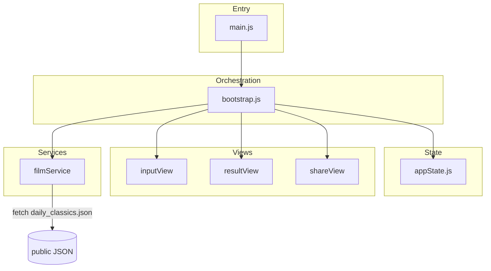

# Jumbo Time Machine (public showcase)

A single-page web app that pairs a birth date with Hong Kong cinema highlights and generates a shareable poster experience.

## Public showcase

> This repository is a public showcase. The complete application and proprietary data pipeline remain private to protect intellectual property and business logic.

This repository contains a **runnable frontend** and a **small sample** [`web/public/daily_classics.json`](web/public/daily_classics.json) (five calendar keys with placeholder film entries). Full production datasets, scrapers, deployment hooks, and internal documentation are **not** included here. A fuller technical walkthrough may be provided in interviews (e.g. screen share) where appropriate.

**Demo tip:** pick a birth date that falls on one of the sample keys so the flow returns films: `01-01`, `03-11`, `06-15`, `10-28`, `12-25` (month-day). Card download assets are included only for those days in this showcase.

## Tech stack

- [Vite](https://vitejs.dev/) 7
- Vanilla ES modules
- [Tailwind CSS](https://tailwindcss.com/) v4 via PostCSS (`@tailwindcss/postcss`)
- Centralized app state with a single render entry and service layer for data loading

## How to run locally

```bash
cd web
npm ci
npm run dev
```

Production build and preview:

```bash
cd web
npm run build
npm run preview
```

Open the URL printed by Vite (typically `http://127.0.0.1:5173/`).

## Repository layout

```
web/
  index.html          # Shell + loading/error UI
  src/
    main.js           # Entry: stylesheet + bootstrap
    app/bootstrap.js  # Orchestration, routing, data load
    state/appState.js # State + explicit setters
    views/            # DOM bindings per screen
    services/         # filmService (fetch JSON)
    …                 # renderers, utilities
  public/
    daily_classics.json   # SAMPLE DATA ONLY
    images/               # Minimal placeholders for demo
```

## Architecture (high level)



## What is intentionally omitted from this showcase

- Production-scale `daily_classics.json` and the data generation pipeline
- Python scrapers, `data/` sources, and operational scripts
- CI deploy hooks, API tokens, and `.env` files
- Third-party analytics bindings (removed from this tree)

## License

MIT — see [LICENSE](LICENSE). Sample film titles and metadata in the JSON are illustrative placeholders for portfolio review.
