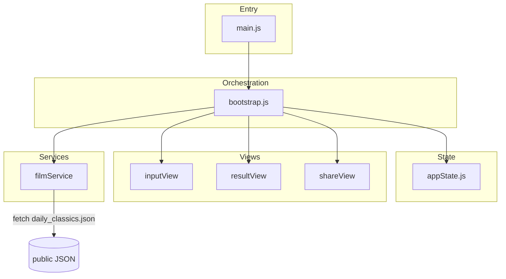

# Jumbo Time Machine (public showcase)

---

## English

A single-page web app that pairs a birth date with Hong Kong cinema highlights and generates a shareable poster experience.

### Public showcase

> This repository is a public showcase. The complete application and proprietary data pipeline remain private to protect intellectual property and business logic.

This repository contains a **runnable frontend** and a **small sample** [`web/public/daily_classics.json`](web/public/daily_classics.json) (five calendar keys with placeholder film entries). Full production datasets, scrapers, deployment hooks, and internal documentation are **not** included here. A fuller technical walkthrough may be provided in interviews (e.g. screen share) where appropriate.

**Demo tip:** choose a birth date that matches one of the sample keys so the flow returns films: `01-01`, `03-11`, `06-15`, `10-28`, `12-25` (month-day). Card download assets are included only for those days in this showcase.

**Tech stack:** [Vite](https://vitejs.dev/) 7, vanilla ES modules, [Tailwind CSS](https://tailwindcss.com/) v4 via PostCSS, centralized app state with a single render entry and a service layer for data loading.

**How to run:** `cd web` → `npm ci` → `npm run dev`. Build: `npm run build` → `npm run preview`. Open the URL Vite prints (e.g. `http://127.0.0.1:5173/`).

**What is omitted:** production-scale JSON, data pipeline, Python scrapers, deploy secrets, `.env`, third-party analytics (removed in this tree).

**License:** MIT — see [LICENSE](LICENSE). Sample JSON entries are illustrative placeholders for portfolio review.

---

## Français

Application web monopage qui associe une date de naissance à des films marquants du cinéma hongkongais et permet de générer une expérience d’affiche à partager.

### Présentation publique (showcase)

> Ce dépôt est une **version showcase publique**. L’application complète et le pipeline de données propriétaire restent **privés** afin de protéger la propriété intellectuelle et la logique métier.

Ce dépôt contient un **frontend exécutable** et un **petit échantillon** [`web/public/daily_classics.json`](web/public/daily_classics.json) (cinq clés calendaires avec des fiches films factices). Les jeux de données de production, scrapers, hooks de déploiement et documentation interne **ne sont pas** inclus. Un parcours technique plus détaillé peut être présenté en entretien (par ex. partage d’écran).

**Astuce démo :** choisissez une date de naissance correspondant à l’une des clés d’exemple pour obtenir des films : `01-01`, `03-11`, `06-15`, `10-28`, `12-25` (mois-jour). Les ressources de téléchargement des cartes ne sont fournies que pour ces jours dans ce showcase.

**Pile technique :** Vite 7, modules ES natifs, Tailwind CSS v4 via PostCSS, état centralisé avec un point de rendu unique et couche service pour le chargement des données.

**Lancer en local :** `cd web`, puis `npm ci` et `npm run dev`. Build : `npm run build` puis `npm run preview`. Ouvrir l’URL indiquée par Vite (souvent `http://127.0.0.1:5173/`).

**Ce qui est exclu :** JSON à l’échelle production, pipeline de données, scrapers Python, secrets de déploiement, fichiers `.env`, télémétrie tierce (retirée dans cet arbre).

**Licence :** MIT — voir [LICENSE](LICENSE). Les entrées JSON d’exemple sont des placeholders pour portfolio.

---

## 中文

单页 Web 应用：根据生日关联香港电影精选，并生成可分享的海报式体验。

### 公开展示（Showcase）

> 本仓库为**公开展示版本**。完整应用与专有数据管线保留为**私有**，以保护知识产权与业务逻辑。

本仓库包含**可运行的前端**与一份**小型示例** [`web/public/daily_classics.json`](web/public/daily_classics.json)（五个日历键、占位影片字段）。生产级数据集、爬虫、部署钩子及内部文档**均未**收录。更完整的技术说明可在面试中另行展示（例如屏幕共享）。

**演示提示：** 请选择落在示例键上的生日，以便流程能返回影片：`01-01`、`03-11`、`06-15`、`10-28`、`12-25`（月-日）。本展示版仅包含上述日期的卡片下载静态资源。

**技术栈：** Vite 7、原生 ES 模块、通过 PostCSS 集成的 Tailwind CSS v4、集中式应用状态与单一渲染入口、数据加载服务层。

**本地运行：** 进入 `web` 后执行 `npm ci`、`npm run dev`；构建使用 `npm run build`，预览使用 `npm run preview`。在浏览器打开 Vite 输出的地址（通常为 `http://127.0.0.1:5173/`）。

**本仓库不包含：** 生产级 JSON、数据生成管线、Python 爬虫、部署密钥、`.env`、第三方统计（本树已移除）。

**许可：** MIT — 见 [LICENSE](LICENSE)。示例 JSON 中的片名与元数据仅供作品集展示。

---

## Repository layout (structure du dépôt / 仓库结构)

```
web/
  index.html          # Shell + loading/error UI
  src/
    main.js           # Entry: stylesheet + bootstrap
    app/bootstrap.js  # Orchestration, routing, data load
    state/appState.js # State + explicit setters
    views/            # DOM bindings per screen
    services/         # filmService (fetch JSON)
    …                 # renderers, utilities
  public/
    daily_classics.json   # SAMPLE DATA ONLY
    images/               # Minimal placeholders for demo
```

## Architecture (high level)



## Commands (commandes / 命令)

```bash
cd web
npm ci
npm run dev
```

```bash
cd web
npm run build
npm run preview
```
